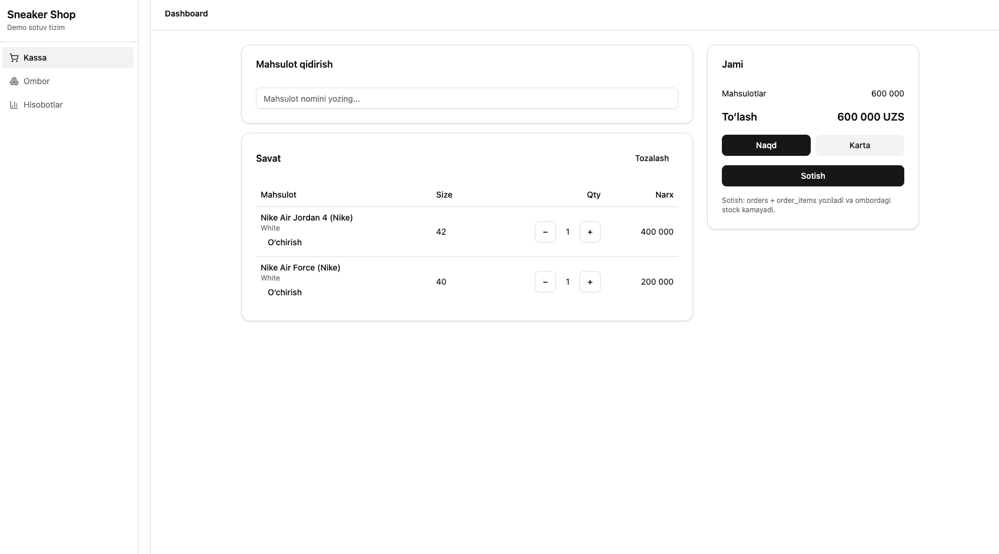
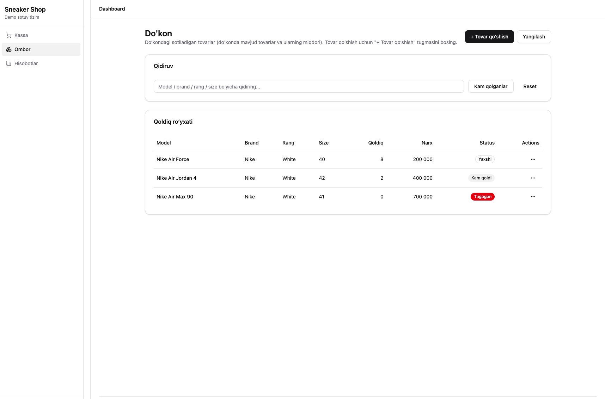
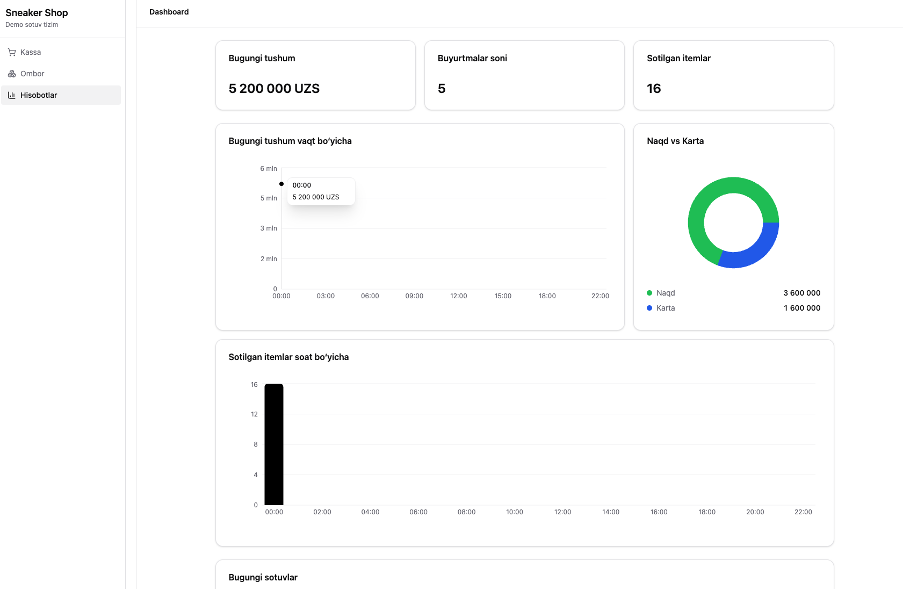

# 👟 Sneaker POS System

Kichik krossovka (sneaker) do‘koni uchun ishlab chiqilgan **POS (Kassa)**,  
**Inventory (Ombor)** va **Reports (Hisobotlar)** tizimi.

Loyiha o‘quv va amaliy maqsadlarda ishlab chiqilgan.

---

## 🚀 Features

- Login / Logout
- Kassa (POS)
- Ombor (Inventory)
- Hisobotlar (Charts)

---

## 🧠 Tech Stack

- React + TypeScript
- Vite
- Shadcn UI + Tailwind CSS
- Supabase (PostgreSQL)

---

## 🔧 Supabase Setup

1. Supabase’da yangi project yarating  
2. Dashboard → SQL Editor → `supabase/schema.sql` faylidagi kodni RUN qiling  
3. `.env.example` asosida `.env` yarating

---

## 🔑 Environment Variables

Project root’da `.env` yarating:

```env
VITE_SUPABASE_URL=
VITE_SUPABASE_ANON_KEY=
```
## ▶️ Run project
```
npm install
npm run dev
```
## 🔐 Demo Login

- Login: admin
- Parol: 1234

---

## 📸 Screenshots

<p align="start">
  
</p>

<p align="center">
  
</p>

<p align="end">
  
</p>
